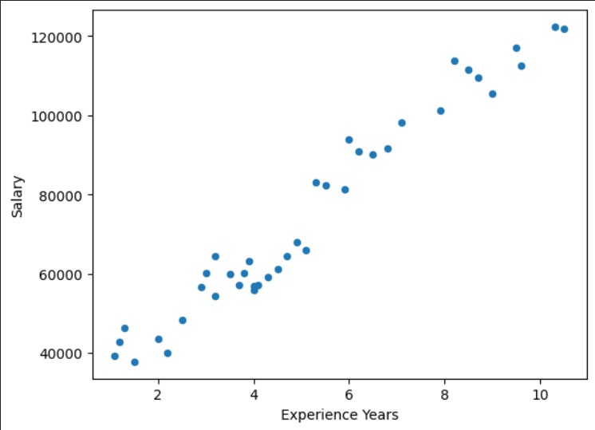

# Salary Prediction with Linear Regression

This project demonstrates how to predict salary based on years of experience using a **custom Linear Regression model** implemented in **PyTorch**. The model is trained using gradient descent to minimize the **Mean Squared Error (MSE)** loss. The dataset is preprocessed, split into training and testing sets, and visualized to provide insights into the relationship between experience and salary.

---

## Table of Contents

1. [Description](#description)
2. [Dataset](#dataset)
3. [Installation](#installation)
4. [Usage](#usage)
5. [Code Overview](#code-overview)
6. [Results](#results)
7. [Visualization](#visualization)

---

## Description

This project implements a **Linear Regression model** from scratch using **PyTorch** to predict salary based on years of experience. The model is trained using **gradient descent** to minimize the **Mean Squared Error (MSE)** loss. The dataset is preprocessed with **standardization** and split into training and test sets for evaluation.

---

## Dataset

The dataset contains two columns:
- **Experience Years**: Number of years of work experience.
- **Salary**: Corresponding salary in USD.

The dataset is sourced from [Salary Data](https://github.com/ybifoundation/Dataset/raw/main/Salary%20Data.csv).

### Example Data

| Experience Years | Salary  |
|------------------|---------|
| 1.1              | 39343   |
| 1.2              | 42774   |
| 1.3              | 46205   |
| 1.5              | 37731   |
| 2.0              | 43525   |

---

## Installation

To run this project, ensure you have the following dependencies installed:

```bash
pip install torch numpy pandas matplotlib scikit-learn
```

---

## Usage

1. **Clone the repository**:
   ```bash
   git clone https://github.com/sedwna/Salary-Dataset-Simple-linear-regression-with-pytorch.git
   ```

2. **Run the Jupyter Notebook**:
   - Open the notebook (`salary_prediction.ipynb`) and execute all cells to train the model and visualize results.

---

## Code Overview

### 1. **Data Loading & Preprocessing**
   ```python
   salary = pd.read_csv('https://github.com/ybifoundation/Dataset/raw/main/Salary%20Data.csv')
   X = salary['Experience Years'].values
   y = salary['Salary'].values
   X_train, X_test, y_train, y_test = train_test_split(X, y, train_size=0.7)
   ```

### 2. **Standard Scaling**
   ```python
   x_scaler = StandardScaler()
   X_train = x_scaler.fit_transform(X_train)
   y_scaler = StandardScaler()
   y_train = y_scaler.fit_transform(y_train)
   ```

### 3. **Custom Linear Regression Model**
   ```python
   class LinearRegression:
       def fit(self, x, y, n=100, eta=0.5):
           # Training loop with gradient descent
           for i in range(n):
               self.linear_regression()
               self.mse()
               self.calc_gradient()
               self.update()
   ```

### 4. **Training & Evaluation**
   ```python
   model = LinearRegression()
   model.fit(X_train, y_train, n=20, eta=0.1)
   y_hat = model.test(X_test, y_test)
   ```

---

## Results

- **Training Loss**: Decreased from **0.57** to **0.039** after 20 epochs.
- **Test Loss**: **0.0403** (MSE on scaled data).

### Example Predictions
After inverse scaling, the predicted and actual salaries are compared:

```python
# Inverse transform scaled predictions
y_hat_actual = y_scaler.inverse_transform(y_hat)
y_test_actual = y_scaler.inverse_transform(y_test)
```

| Experience Years | Actual Salary | Predicted Salary |
|------------------|---------------|------------------|
| 7.1              | 98273         | 93108            |
| 5.5              | 82200         | 77795            |
| 1.3              | 46205         | 37598            |

---

## Visualization

### 1. **Scatter Plot of Experience vs Salary**
   ```python
   salary.plot(kind='scatter', x='Experience Years', y='Salary')
   plt.show()
   ```

    

### 2. **Train vs Test Data**
   ```python
   plt.scatter(X_train, y_train, s=100)
   plt.scatter(X_test, y_test, s=100)
   plt.legend(['Train', 'Test'])
   plt.show()
   ```

    *Replace with actual plot from your notebook.*

### 3. **Real vs Predicted Salaries**
   ```python
   plt.scatter(X_test, y_test, s=20)
   plt.scatter(X_test, y_hat, s=60)
   plt.legend(['Real', 'Predict'])
   plt.show()
   ```

    *Replace with actual plot from your notebook.*

---

## Contributing

Contributions are welcome! If you'd like to contribute, please:
1. Fork the repository.
2. Create a new branch for your feature or bugfix.
3. Submit a pull request.

---

## Contact

For questions or feedback, feel free to reach out:
- **Email**:  [sajaddehqan2002@gmail.com]

---

